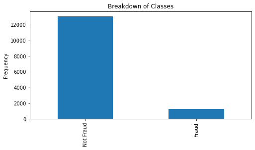
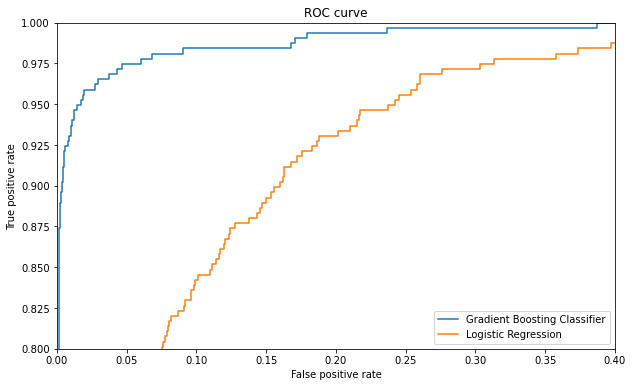
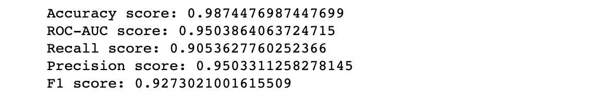
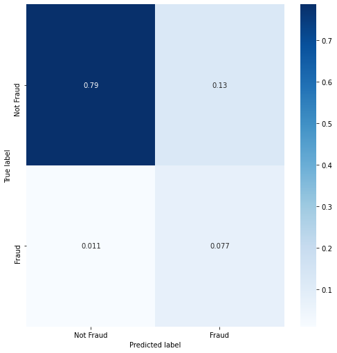
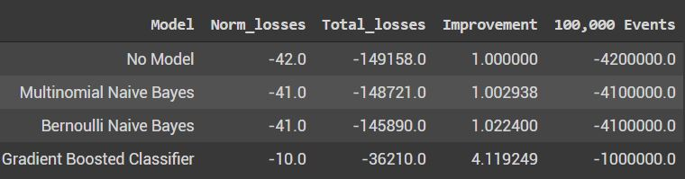

## Modeling Workflow

### Initial EDA

Our first task was to explore the dataset and identify any relevant characteristics that would inform our modeling techniques. Among our findings were two important characteristics. The first was the clear class imbalance:

Only about 9% of the total observations in our dataset were classified as fraud. In order to ensure our models are actually working to identify fraud, this imbalance needed to be taken into account, perhaps by passing class weights to our models. Furthermore, it meant that we would have to consider metrics other than pure accuracy to properly evaluate our model, since a model that only ever predicts 'not fraud' would still have a relatively high accuracy of 91%. In particular, we want to look at scores like precision, recall, roc-auc, and f-1. 

Additionally, we noted that there were a combination of numerical, categorical, and natural language features in the data. In order to wring as much predictive value out of our data as possible, we decided to split up the work into two parallel modeling groups. One group would build a model focusing purely on the numerical and categorical data, while the other would build a model using natural language processing. Once those models were complete, we could use a combination of their predicted probabilities for a given test example to make a final prediction.

### Preprocessing the Numerical and Categorical Data

Several important steps were taken to process the numerical/categorical data before modeling:
 - Removing natural language features
 - Identifying and one-hot encoding the necessary categorical features. Ensuring this was done in such a way as to be reproducible when testing on new data.
 - Locating and filling nans with reasonable substitutes
 - Extracting numerical data from 'object' columns (e.g. 'previous_payouts') and feature engineering (e.g. latitude/longitude becoming a boolean 'has_lat_long')

Obviously, it was important to preserve all of these steps as a preprocessing pipeline for use during the testing/production phase

### Metrics selection

As mentioned previously, the task is to identify fraud cases, but with fraud being a relatively infrequent class, alternatives to accuracy must be used. In particular, using an ROC-AUC score and visualizing with the ROC curve will be useful in maximizing our true positive identifications of fraud and minimizing our false positive rate. Other useful measures will be precision, recall, and their harmonic mean, f1-score. These metrics will give us a much better idea of how good our model is at specifically at detecting fraud.

### Validation, testing, and hyperparameter tuning.

We decided to test two types of models on the numerical/categorical data: a Logistic Regression and a Gradient Boosting Classifier. In order to get the best possible performance out of each model type, we performed a Randomized Grid Search with cross-validation. We tested a wide variety of class weights, l1 vs. l2 regularization, regularization coefficients for the Logistic Regression, as well as learning rate, subsample size, max features, max depth, number of estimators for the Gradient Boosting Classifier. We selected the version of the model with the best roc-auc score, and compared them:

The Gradient Boosting Classifier shows clear improvement over the Logistic Regression Model. In particular, we found success with a GBC that decreased the default subsample size and the learning rate while increasing the number of estimators. This seemed to strike a decent balance in the bias/variance tradeoff. Here are our final metrics after a 5-fold cross validation on our final GBC model:

### Further steps

In order to focus on the rest of the production pipeline, we put a halt on finishing and integrating an NLP model with our Gradient Boosting Classifier. We would also like to spend more time engineering more useful features and interpreting/visualizing the feature importances, beyond identifying some of the most valuable features for classification: previous payouts, user age, gts, and sale duration.

The average loss per case of fraud is $461.79. Cost of a false negative. Cost of investigating a possible fraud case is unknown.

